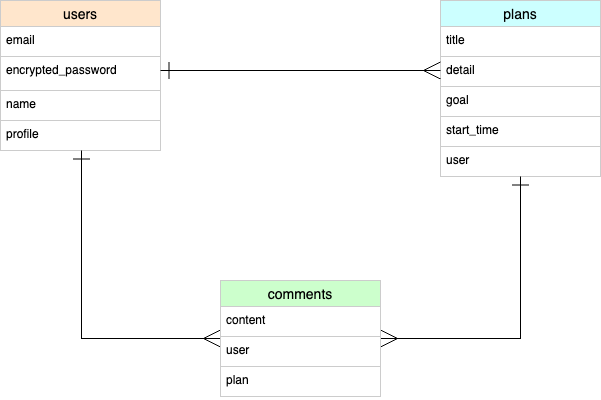
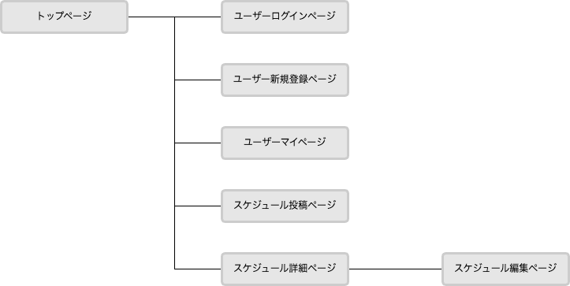

# アプリケーション名
schedule management

# アプリケーション概要

# URL

# テスト用アカウント

# 利用方法

# 制作背景

# 実装予定の機能

# データベース設計

# 画面遷移図

# 開発環境

# ローカルでの動作方法

# 工夫したポイント

# 改善点

# 制作時間

# テーブル設計

## users テーブル

| Column             | Type   | Options     |
| ------------------ | ------ | ----------- |
| email              | string | null: false |
| encrypted_password | string | null: false |
| nickname           | string | null: false |
| profile            | text   | null: false |

### Association

- has_many :schedules
- has_many :comments

## schedules テーブル

| Column     | Type       | Options                        |
| ---------- | ---------- | ------------------------------ |
| title      | string     | null: false                    |
| detail     | text       | null: false                    |
| goal       | string     | null: false                    |
| start_time | datetime   | null: false                    |
| user       | references | null: false, foreign_key: true |

### Association

- belongs_to :user
- has_many :comments

## comments テーブル

| Column   | Type       | Options                        |
| ---------| ---------- | ------------------------------ |
| content  | text       | null: false                    |
| user     | references | null: false, foreign_key: true |
| schedule | references | null: false, foreign_key: true |

### Association

- belongs_to :user
- belongs_to :schedule
